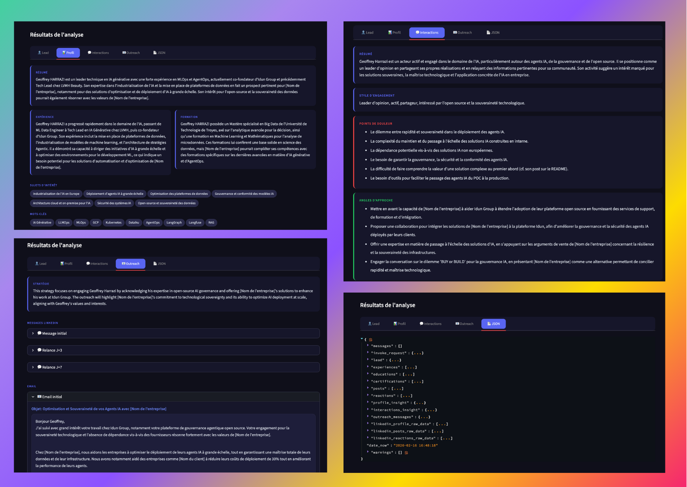

# 🇫🇷 Chloé - Agent IA de prospection LinkedIn.

## Pourquoi Chloé ?

La prospection LinkedIn est chronophage : analyser un profil, comprendre les centres d'intérêt d'un lead, rédiger des messages personnalisés... Chloé automatise tout ça.

Donnez-lui une URL LinkedIn, et en quelques secondes vous obtenez :
- **Insight Profil** : résumé, expérience, formation, sujets d'intérêt
- **Insight Interactions** : style d'engagement, points de douleur, angles d'approche
- **Messages Outreach** : messages LinkedIn et emails personnalisés, prêts à envoyer




---

## Quick Start

```bash
# 1. Clone & setup
git clone <repo>
cd chloe-api
cp .env.example .env

# 2. Configurer .env avec vos clés API (voir section Configuration)

# 3. Lancer
make serve   # API sur localhost:8001
make ui      # Streamlit sur localhost:8501
```

---

## Configuration

Variables requises dans `.env` :

| Variable | Description |
|----------|-------------|
| `LLM_PROVIDER` | `openai` ou `gemini` |
| `LLM_MODEL_NAME` | Ex: `gpt-4o`, `gemini-2.0-flash` |
| `OPENAI_API_KEY` | Clé API OpenAI (si provider openai) |
| `GEMINI_API_KEY` | Clé API Gemini (si provider gemini) |
| `APIFY_API_TOKEN` | Token [Apify](https://apify.com/) pour le scraping LinkedIn |

Une fois lancé, naviguez vers `http://localhost:8501` pour accéder à l'interface Streamlit.

---

## Architecture

Chloé est un **agent LangGraph** déployé avec **[Idun Agent Platform](https://github.com/Idun-Group/idun-agent-platform)** ⭐

> **Idun Agent Platform** est notre solution open-source pour déployer des agents LangGraph/ADK/Haystack en production. La plateforme génère automatiquement une API REST, l'observabilité, Tools/MCPs et les Guardrails, à partir d'un simple fichier de configuration. Zéro code FastAPI à écrire.
>
> 👉 [github.com/Idun-Group/idun-agent-platform](https://github.com/Idun-Group/idun-agent-platform) - N'hésitez pas à mettre une étoile !

### Comment ça marche

1. **LangGraph Workflow** (`app/agent/workflow_graph.py`)
   Le workflow orchestre les étapes : récupération du profil LinkedIn via [Apify](https://apify.com/), extraction des posts/réactions, génération des insights avec le LLM.

2. **Idun Agent Platform**
   L'API REST, la documentation Swagger, et l'observabilité (Langfuse) sont générées automatiquement par la plateforme à partir du fichier `config.yaml` :

```yaml
server:
  api:
    port: 8001
agent:
  type: ""
  config:
    name: "Chloé"
    graph_definition: "app/agent/workflow_graph.py:app"
    input_schema_definition: "invoke_request"
    checkpointer:
      type: "memory"
```

Pas besoin d'écrire de code FastAPI - la plateforme expose automatiquement votre agent LangGraph en API.

### Data Sources

Le scraping LinkedIn est réalisé via les actors [Apify](https://apify.com/) :
- [apimaestro/linkedin-profile-detail](https://apify.com/apimaestro/linkedin-profile-detail)
- [apimaestro/linkedin-profile-posts](https://apify.com/apimaestro/linkedin-profile-posts)
- [apimaestro/linkedin-profile-reactions](https://apify.com/apimaestro/linkedin-profile-reactions)

---

## Aller plus loin

Avec Idun Agent Platform, vous pouvez étendre Chloé avec :

- **Observabilité** (Langfuse, Phoenix, GCP Trace) - Tracez et debuggez vos agents en production
  👉 [Documentation Observability](https://idun-group.github.io/idun-agent-platform/observability/overview/)

- **Guardrails** - Ajoutez des garde-fous pour sécuriser les entrées/sorties de l'agent
  👉 [Documentation Guardrails](https://idun-group.github.io/idun-agent-platform/guardrails/overview/)

- **MCPs** (Model Context Protocol) - Connectez des outils externes à votre agent
  👉 [Documentation MCP](https://idun-group.github.io/idun-agent-platform/mcp/overview/)

- **Mémoire** - Utiliser une mémoire Postgres ou SQLite pour enregistrer vos interactions
  👉 [Documentation Mémoire](https://idun-group.github.io/idun-agent-platform/memory/memory-langgraph/)

---

## Support

contact@idun-group.com


Pour propuler vos agents LangChain, LangGraph ou ADK jeter un oeil à la plateforme open-source:
👉 [github.com/Idun-Group/idun-agent-platform](https://github.com/Idun-Group/idun-agent-platform) - N'hésitez pas à mettre une étoile !
